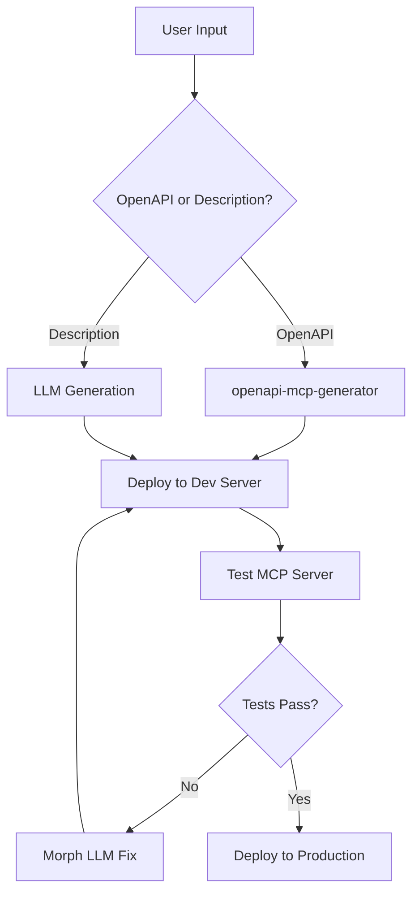

# MCP Generator LangGraph Agent

[](https://github.com/langchain-ai/new-langgraph-project/actions/workflows/unit-tests.yml)
[](https://github.com/langchain-ai/new-langgraph-project/actions/workflows/integration-tests.yml)

A [LangGraph](https://github.com/langchain-ai/langgraph) agent that automatically generates, deploys, tests, and refines [MCP (Model Context Protocol)](https://modelcontextprotocol.io/) servers. The agent can create MCP servers from either OpenAPI specifications or natural language descriptions.

<div align="center">
  
</div>

## Features

- **Dual Generation Paths**:
  - **OpenAPI Spec**: Uses [openapi-mcp-generator](https://github.com/harsha-iiiv/openapi-mcp-generator) to create MCP servers from OpenAPI specifications
  - **Natural Language**: Uses Claude to generate MCP servers from plain English descriptions

- **Automated Deployment**: Deploys to [Freestyle.sh](https://docs.freestyle.sh/) dev servers for testing

- **Intelligent Testing**: Comprehensive test suite validates MCP protocol compliance

- **Self-Healing**: Uses Morph LLM to automatically fix errors and refine the generated code

- **Iterative Refinement**: Test → Fix → Redeploy cycle until the server works correctly

## How It Works



## Getting Started

### Prerequisites

- Python 3.9+
- Node.js 20+
- [Freestyle CLI](https://docs.freestyle.sh/getting-started/installation) (for deployment)
- API Keys:
  - Anthropic API key (required for description-based generation)
  - Morph LLM API key (optional, for automated fixes)
  - Freestyle API key (optional, for cloud deployment)

### Installation

1. Clone the repository and install dependencies:

```bash
cd mcp-generator
pip install -e . "langgraph-cli[inmem]"
```

2. Install Node.js dependencies for MCP generation:

```bash
npm install -g openapi-mcp-generator
```

3. Create a `.env` file with your API keys:

```bash
# Required for description-based generation
ANTHROPIC_API_KEY=your_anthropic_api_key

# Optional
MORPH_API_KEY=your_morph_api_key
FREESTYLE_API_KEY=your_freestyle_api_key
LANGSMITH_API_KEY=your_langsmith_api_key
```

### Usage

#### Run with LangGraph Studio

Start the LangGraph development server:

```bash
langgraph dev
```

This will open LangGraph Studio where you can:
- Input OpenAPI specs or natural language descriptions
- Watch the agent generate, deploy, and test MCP servers
- Debug and iterate on the generated code

#### Run Programmatically

See the `examples/` directory for usage examples:

```python
from agent import graph

# Generate from OpenAPI spec
input_state = {
    "openapi_url": "https://petstore.swagger.io/v2/swagger.json",
    "max_iterations": 3,
    # ... other required state fields
}

result = await graph.ainvoke(input_state, config)
```

#### Generate from Description

```python
# Generate from natural language
input_state = {
    "user_description": """
    Create an MCP server that provides tools for:
    1. Searching GitHub repositories
    2. Getting repository details
    3. Creating issues
    """,
    "max_iterations": 5,
    # ... other required state fields
}

result = await graph.ainvoke(input_state, config)
```

## Architecture

### State Management

The agent uses a structured state to track progress:

```python
class MCPGeneratorState:
    input_type: "openapi" | "description"
    mcp_server_code: Dict[str, str]
    deployment_stage: "none" | "dev" | "prod"
    test_results: List[TestResult]
    refinement_history: List[RefinementRecord]
    current_phase: Phase
    # ... and more
```

### Core Nodes

1. **Classify**: Determines input type (OpenAPI vs description)
2. **Generate**: Creates MCP server code using appropriate method
3. **Deploy**: Deploys to Freestyle.sh dev server
4. **Test**: Validates MCP protocol compliance
5. **Refine**: Uses Morph LLM to fix issues
6. **Deploy Production**: Final deployment when tests pass

### Testing Suite

The agent runs comprehensive tests on generated MCP servers:

- Server health checks
- MCP protocol connection
- Tool listing and validation
- Schema validation
- Basic tool execution
- Error handling

## Development

### Running Tests

```bash
# Unit tests
make test

# Integration tests (requires API keys)
make integration_tests

# Run specific test
pytest tests/unit_tests/test_configuration.py -v
```

### Project Structure

```
mcp-generator/
├── src/agent/
│   ├── graph.py         # Main LangGraph workflow
│   ├── generators.py    # MCP generation logic
│   ├── deployer.py      # Freestyle.sh deployment
│   ├── tester.py        # MCP testing suite
│   └── refiner.py       # Morph LLM integration
├── examples/            # Usage examples
├── tests/              # Test suite
└── langgraph.json      # LangGraph configuration
```

## Configuration

The agent accepts various configuration options:

```python
config = {
    "configurable": {
        "max_iterations": 5,           # Max refinement attempts
        "anthropic_api_key": "...",    # For LLM generation
        "morph_api_key": "...",        # For code fixes
        "freestyle_api_key": "...",    # For deployment
        "use_local_freestyle": True,   # Use local dev server
    }
}
```

## Troubleshooting

### Common Issues

1. **OpenAPI Generation Fails**
   - Ensure `openapi-mcp-generator` is installed globally
   - Check that the OpenAPI spec is valid

2. **Deployment Fails**
   - Verify Freestyle CLI is installed and configured
   - Check Node.js version (requires v20+)

3. **Tests Timeout**
   - Increase timeout in configuration
   - Check server logs for startup errors

## Contributing

Contributions are welcome! Please:

1. Fork the repository
2. Create a feature branch
3. Add tests for new functionality
4. Submit a pull request

## License

MIT License - see LICENSE file for details

## Acknowledgments

- [LangGraph](https://github.com/langchain-ai/langgraph) for the agent framework
- [openapi-mcp-generator](https://github.com/harsha-iiiv/openapi-mcp-generator) for OpenAPI conversion
- [Freestyle.sh](https://freestyle.sh) for deployment platform
- [Morph LLM](https://morphllm.com) for code refinement capabilities